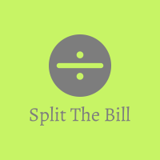

# split_the_bill

An end-to-end application that focuses on implementing the idea of separating a bill equally among different members of a group. Entire application is created using react along with some parts being designed using Material UI. The backend for this application is separately maintained in <a href="https://github.com/kapsxx/split_the_bill_backend" >split_the_bill_backend</a>.

## Steps to run the project locally
* Run <a href="https://github.com/kapsxx/split_the_bill_backend" >split_the_bill_backend</a> before running this project
* Clone this repository in your desired local location
* Open terminal, and change the directory to "split-the_bill" folder
* Run ```npm install``` command
* Now, run ```npm start``` command

## Features included in this application
* User can add members in a group
* User can add comodities and prices accordingly
* Finally, the user can settle the entire bill among all the members of the group
* User can sign in
* User (authentication not required) can search any invoice via unique hash
* Only authenticated user can upload his/her own invoice in database

## Tech stack
* HTML
* CSS
* JavaScript
* React
* Context-API
* Framer-Motion
* Material-UI
* Material-Icons

## Deployed link
https://kapil-pant-split-the-bill.vercel.app/
